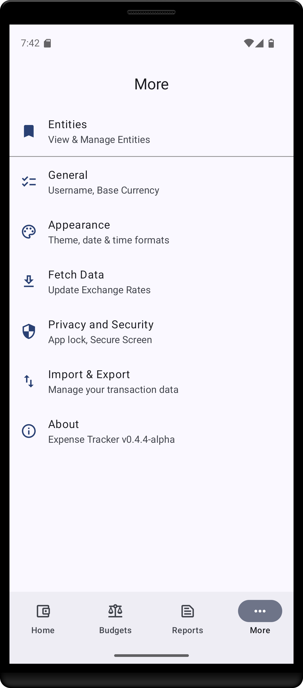
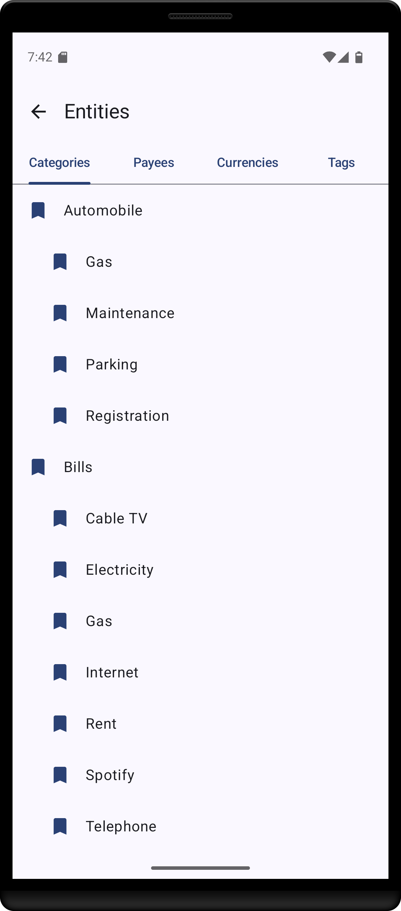
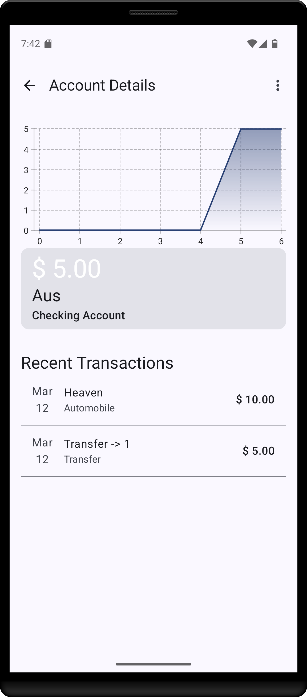
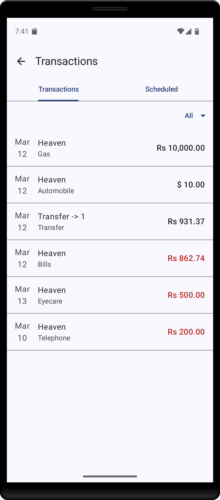
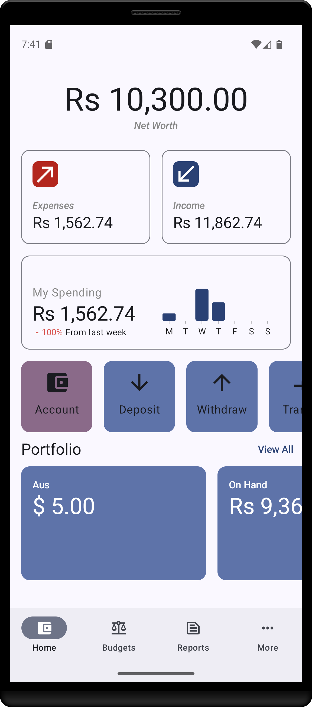
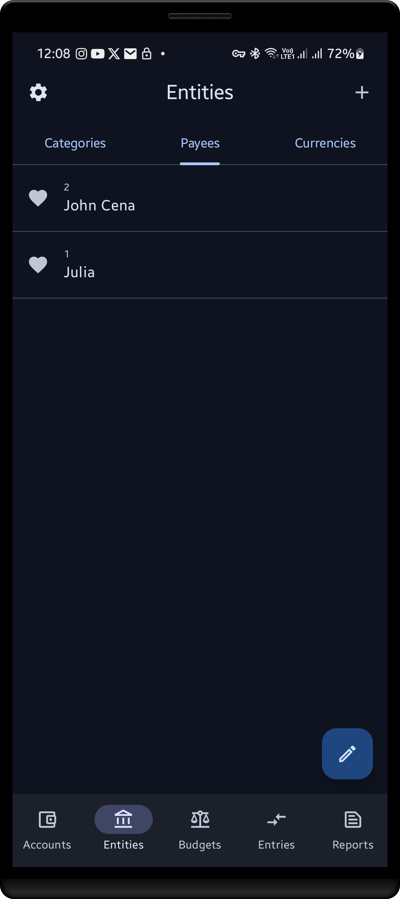

# Expense Tracker


[](https://app.codacy.com/gh/seyone22/Expense_Tracker/dashboard?utm_source=gh&utm_medium=referral&utm_content=&utm_campaign=Badge_grade)


Expense Tracker is a personal finance application for Android, designed to help users manage their
expenses efficiently. It draws inspiration from the popular Money Manager EX project but offers a
modernized approach to expense tracking on the Android platform. Leveraging modern Android
development practices, Expense Tracker utilizes Jetpack Compose for UI development and Room for
database management. Our aim is to provide feature parity with Money Manager EX while delivering a
more intuitive and user-friendly experience.

## Features

Expense Tracker currently offers the following features:

- **Account Management:** Users can create and manage multiple accounts to organize their finances.
- **Transaction Tracking:** Record and categorize transactions to monitor income and expenses.
- **Reporting:** Generate basic reports to analyze spending patterns over time.
- **Entity Management:** Manage categories, payees, and currencies to customize the app according to
  individual needs.
- **Automatic Currency Updates:** Expense Tracker fetches currency exchange rates from the European
  Union InfoEuro system for monthly updates.

<div style="display: flex; flex-wrap: wrap; justify-content: center;">
    
    
     
</div>
<div style="display: flex; flex-wrap: wrap; justify-content: center;">
    
    
    
</div>
<div style="display: flex; flex-wrap: wrap; justify-content: center;">
    
    
</div>

## Installation

### APK Installation

1. Download the APK file from
   the [latest release](https://github.com/seyone22/Expense_Tracker/releases/tag/v0.1.2-alpha).
2. Transfer the APK file to your Android device.
3. Open the APK file on your device and follow the installation prompts.

### Building from Source

1. Clone the repository to your local machine:
   ```git clone https://github.com/yourusername/expense-tracker.git```
2. Open the project in Android Studio.
3. Build and run the project on an Android device or emulator.

## Testing

Expense Tracker currently lacks automated test coverage. Contributions to add testing support are
highly encouraged and appreciated. Please refer to the CONTRIBUTING.md file for guidelines on
contributing to the project.

## Built With

Expense Tracker is built using the following technologies and libraries:

- [Jetpack Compose](https://developer.android.com/jetpack/compose)
- [Room](https://developer.android.com/jetpack/androidx/releases/room)
- [Material UI](https://material.io/components)
- [Retrofit](https://square.github.io/retrofit/)

## Versioning

Expense Tracker follows semantic versioning for version management. For the available versions, see
the [tags on this repository](https://github.com/seyone22/expense_tracker/tags).

## Author

Expense Tracker is developed by S.G. Seyone.

## Contributing

Contributions to Expense Tracker are welcome! Please review the guidelines outlined in
the [CONTRIBUTING.md](CONTRIBUTING.md) file before contributing.

## License

Expense Tracker is licensed under the [MIT License](LICENSE.md). See the LICENSE.md file for
details.

## Acknowledgments

We extend our gratitude to the developers of Money Manager EX for their pioneering work in personal
finance management. Special thanks to the European Union InfoEuro system for providing currency
exchange rate data.
